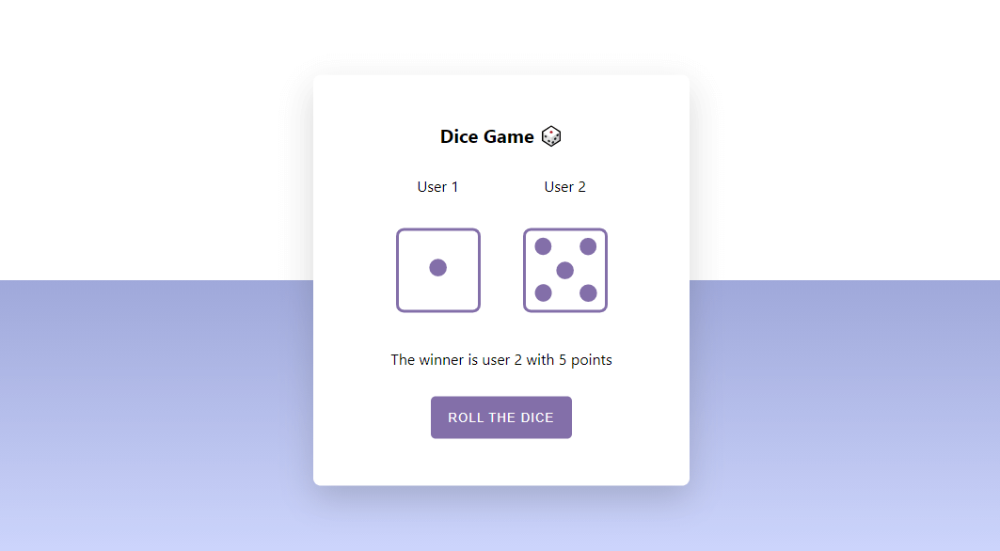

# Dice Game 🎲

This is a Dice Game build with React JS.



Site:

## Technologies

This game is built with:

- React JS

## Install project

Download this project:

```sh
git clone git@github.com:iscasur/dice-game.git
```

Go to the project directory:

```sh
cd dice-game
```

Install all dependencies

```sh
npm install
```

Run development enviroment

```sh
npm start
```

Runs the app in the development mode.\
Open [http://localhost:3000](http://localhost:3000) to view it in the browser.

## License

This project is MIT licensed
